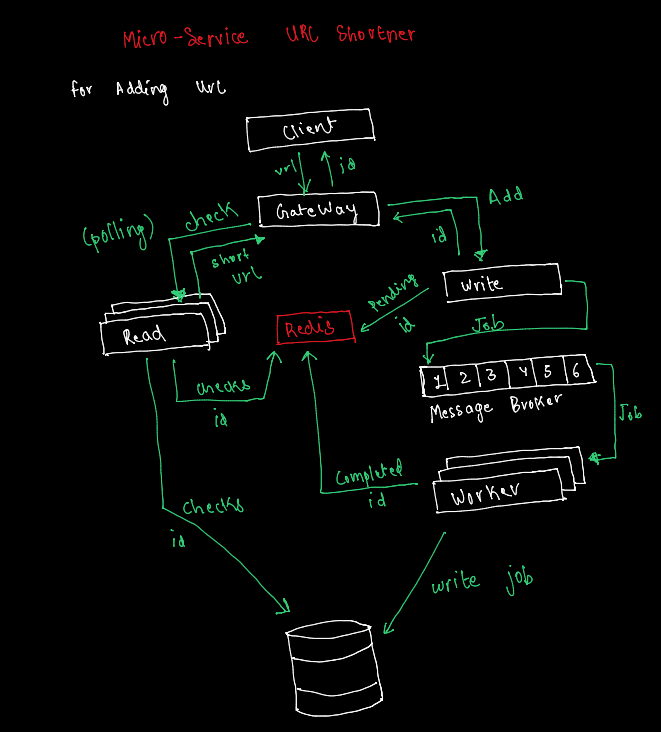
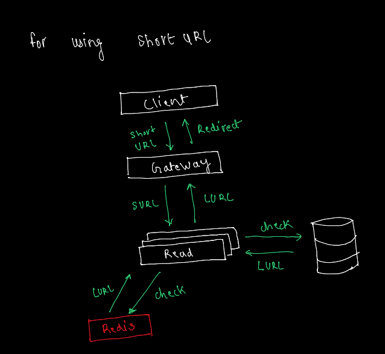
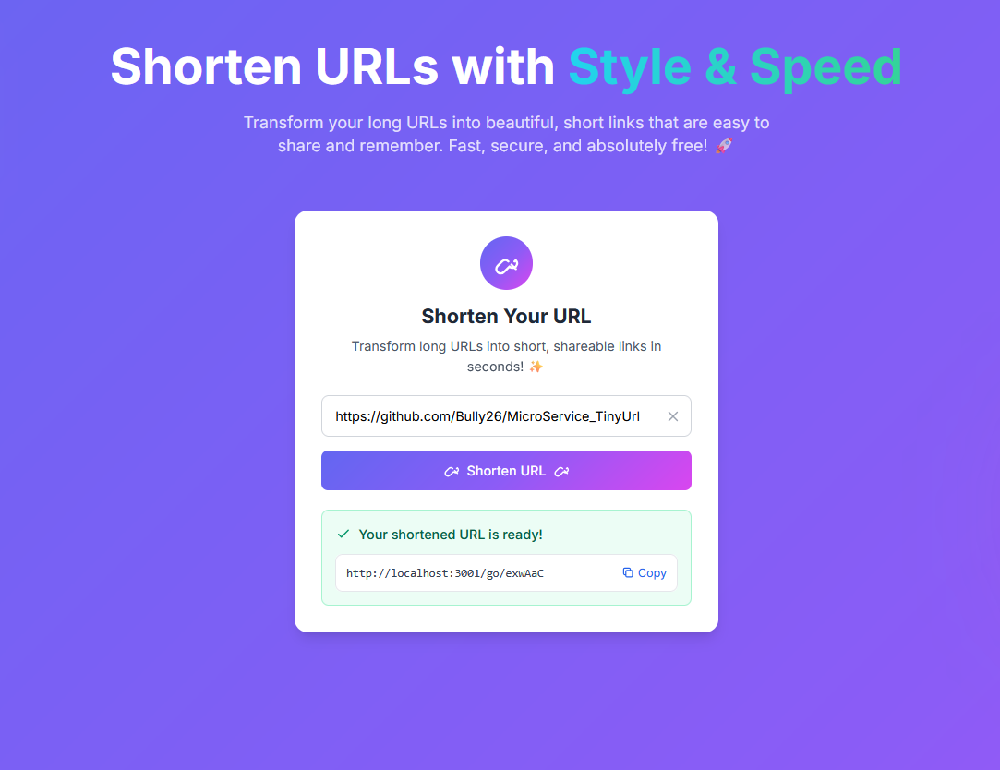

# 🔗 MicroService TinyURL

A lightweight, containerized **URL SHORTNER** built using microservices architecture. This project separates **read** and **write** services, stores URLs in Redis, and is designed for scalability using Docker.

---

##  Architecture

###  Write Service Architecture

###  Read Service Architecture

---

## 📸 UI - Working Site

| Home Page | Shortened URL Page |
|-----------|---------------------|
|  |  |

---

##  Tech Stack

- **Node.js** (Express) — for microservices
- **Redis** — fast in-memory data store
- **Docker & Docker Compose** — for containerization and service orchestration
- **Postman** — for testing API endpoints

---

##  Features

- Generate short URLs
- Redirect to original long URLs
- Microservice separation of **read** and **write**
- Fast lookup using Redis
- Scalable and Dockerized architecture

---
- git clone https://github.com/Bully26/MicroService_TinyUrl.git
- cd MicroService_TinyUrl
- docker-compose up --build
